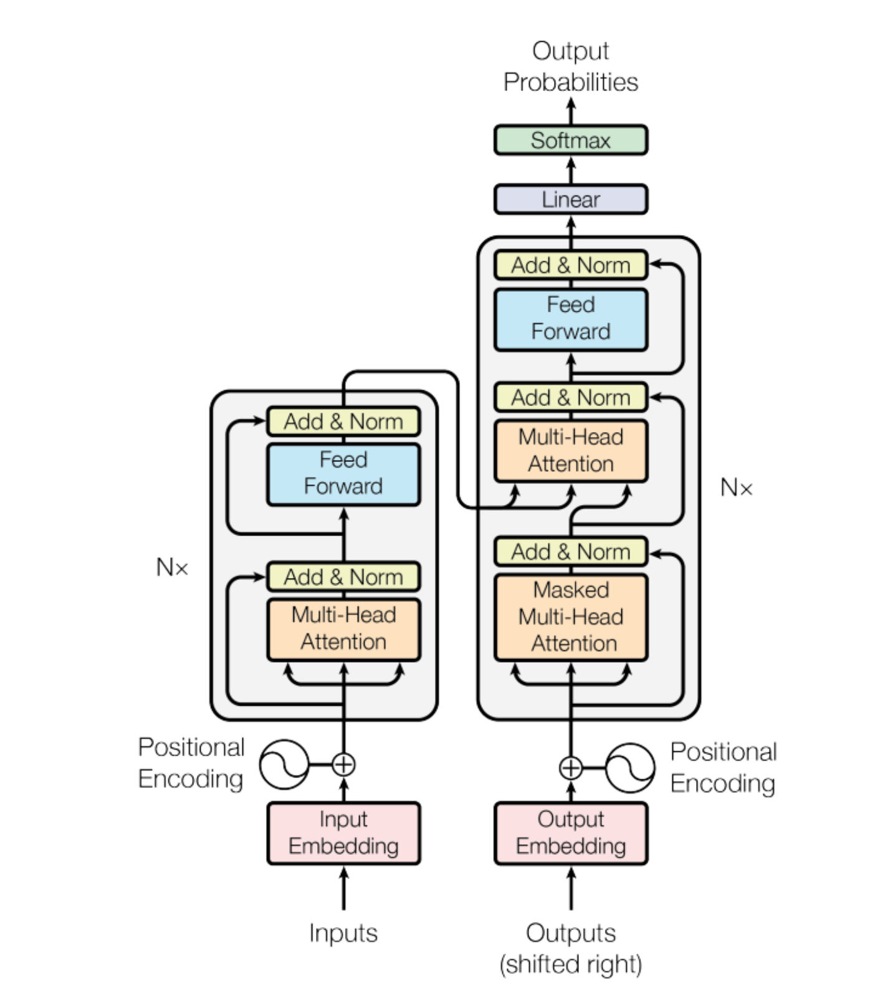

# Attention Is All You Need (2017)

## What's left to conquer?

So far we've built: simple classification (perceptron), image classification (CNNs), sequence generation (LSTMs). But there's a harder problem - **translation**. Taking a sentence in one language and producing it in another.

The difficulties: different **languages** (different vocabularies, different grammar), different **lengths** ("I am a student" → "Je suis étudiant" - 4 words to 3). You can't just go word by word.

## Seq2Seq (2014) - Google

The first serious solution. Chain two LSTMs together:

**Encoder** - an LSTM that reads the entire input sentence. Doesn't output anything along the way. Just absorbs the meaning. After the last word, its hidden state becomes the **context vector** - the entire sentence compressed into one fixed-size vector.

**Decoder** - a separate LSTM that takes the context vector and generates the translation, word by word.

```
Encoder: "I" → "love" → "cats" → [context vector]
Decoder: [context vector] → "J'aime" → "les" → "chats"
```

Google Translate used this from 2016. It was a huge improvement.

**But - the bottleneck.** The context vector is a fixed-size vector (say 256 numbers). Whether the input is 3 words or 100 words, everything gets squeezed into those same 256 numbers. Recent words dominate. Early words vanish. Long sentences came out garbled - the translations would start okay and drift into nonsense.

## Bidirectional LSTM

One attempt at fixing the vanishing context: if the forward LSTM forgets early words by the end, why not also run an LSTM **backward**? One reads left-to-right, another reads right-to-left. Combine their hidden states - now each position knows its past AND its future.

Helped, but still sequential. Still slow. Still a bottleneck.

## Attention (2015) - Bahdanau

The real fix. During encoding, the LSTM produces a hidden state at **every** step - not just the final one:

```
"I"    → hidden_1
"love" → hidden_2
"cats" → hidden_3
```

In Seq2Seq we threw away hidden_1 and hidden_2. Only kept hidden_3. All that work - wasted.

Bahdanau said: **keep all of them.** Let the decoder access every encoder hidden state whenever it wants.

But not equally - at each step, some words are more relevant than others. So the decoder computes **attention weights** - how much to focus on each input word:

```
Generating "J'aime":  weights → "I"(0.30) "love"(0.60) "cats"(0.10)
Generating "chats":   weights → "I"(0.10) "love"(0.10) "cats"(0.80)
```

Each decoder step gets a **custom context** - not one fixed vector, but a weighted mix of all encoder states. No bottleneck. Long sentences work because early words are always directly reachable.

## So... why do we even need LSTMs anymore?

Attention connects any two words directly, regardless of distance. The decoder can reach word 1 just as easily as word 100. No vanishing. No bottleneck.

What were LSTMs still bringing to the table? **Order.** They process words sequentially - that's how they know "I" comes before "love."

But what if you could tell the model about order *without* sequential processing?

## Attention Is All You Need (2017) - Google Brain

Eight researchers proposed: throw away recurrence entirely. No RNNs. No LSTMs. **Only attention.** Tag each word with its position using **positional encoding** - and process everything in parallel.

They called it the **Transformer.**

```
LSTM:        word1 → word2 → word3 → word4  (sequential, slow)
Transformer: word1, word2, word3, word4      (parallel, fast)
```

## The architecture

### Word Embedding

Words become vectors - a lookup table where each word maps to a list of numbers. "Cat" might be `[0.2, -0.5, 0.8, ...]`. These are learned during training - similar words end up with similar vectors. Same concept as character embeddings in the LSTM chapter, but for words.

### Positional Encoding

Without sequential processing, the model has no idea about word order. "I love cats" and "cats love I" would look identical. Positional encoding fixes this - each position (0, 1, 2, ...) gets its own vector, **added** to the word embedding:

```
"cats" at position 3 = embedding("cats") + embedding(position 3)
```

Now each word carries both *what it is* and *where it is*.

### Query, Key, Value (Q, K, V)

The core of attention. For every word, create three vectors from its embedding:

- **Q (Query)** - "What am I looking for?"
- **K (Key)** - "What do I contain?"
- **V (Value)** - "What information do I give if selected?"

Like a library: walk in with a query, compare against every book's key, pull the matching books and read their values.

The math:

```
Q = embedding × W_Q    (learned weight matrix)
K = embedding × W_K
V = embedding × W_V

scores = Q × K^T / √(d_k)     (how well does each query match each key?)
weights = softmax(scores)       (normalize to percentages)
output = weights × V            (weighted mix of values)
```

### Self-Attention

A sentence looking at **itself**. Every word compares its query against every other word's key, finds the most relevant words, and creates a contextually enriched representation of itself.

"It" in *"The animal didn't cross the street because it was too tired"* attends strongly to "animal" - because "animal" is most relevant to understanding what "it" means.

### Multi-Head Attention

Don't do attention once - do it **8 times in parallel**. Not one after another - all 8 heads' Q, K, V vectors are created at the same time from one big matrix multiplication, then split into heads. Each head has its own Q, K, V weight matrices. Each learns to focus on a different type of relationship:

```
Head 1: might learn syntactic relationships (subject-verb)
Head 2: might learn semantic relationships (meaning similarity)
Head 3: might learn positional relationships (nearby words)
...
All 8 run simultaneously - that's what makes it fast.
```

All heads' outputs are concatenated and combined through a linear layer.

### Masked Self-Attention

Used in the decoder. When predicting word 3, the model can only see words 1 and 2 - not future words. A mask sets future positions to negative infinity before softmax, making them invisible:

```
         word1  word2  word3
word1  [  0.5,  -inf,  -inf ]   ← can only see itself
word2  [  0.2,   0.7,  -inf ]   ← sees word1 and itself
word3  [  0.6,   0.1,   0.9 ]   ← sees everything before it
```

After softmax, -inf becomes 0. Future words are completely invisible.

### Cross-Attention

The decoder talks to the encoder. Queries come from the decoder ("what am I trying to generate?"), keys and values come from the encoder ("here's what the input contains"). This is Bahdanau's attention idea - but without LSTMs.

### Skip Connections and Layer Normalization

Old friends from ResNet. After every attention and feed-forward step:

```
output = LayerNorm(input + sublayer(input))
```

Skip connections let gradients flow. Layer normalization keeps signals stable. Same reasons as before - essential for stacking 6 layers deep.

## The Full Transformer



> checkout the working demo: [link](https://poloclub.github.io/transformer-explainer/)

**Encoder** (Person A - the reader). 6 identical layers, each:
- word embedding
- positional embedding
- multi-head attention
- add + norm
- feed forward
- add + norm

**Decoder** (Person B - the writer). 6 identical layers, each:
- word embedding
- positional embedding
- masked multi-head attention
- add + norm
- cross attention ← encoder output
- add + norm
- feed forward
- add + norm
- linear → softmax → predicted word

**Training:** all target words fed in at once. Mask prevents peeking ahead. All predictions happen in parallel.

**Inference:** one word at a time. Each prediction fed back as input. Loops until <EOS>. Mask has nothing to hide - effectively just self-attention.

## How the Decoder Actually Works

Let's trace translating "I love cats" → "J'aime les chats." The encoder has already processed "I love cats" - that's done. Now the decoder generates the French sentence.

At **position 2** - the decoder is at "les" and needs to predict "chats":

**Step 1: Masked self-attention** - "les" looks at the target words generated so far:

```
"les" can see: <START>, J'aime, les
"les" cannot see: chats (masked)

Weights: <START>(0.05)  J'aime(0.35)  les(0.60)
```

Output: "les" enriched with context from the French sentence so far.

**Step 2: Cross-attention** - "les" talks to the encoder:

```
Query: from "les" (decoder)
Keys & Values: from "I", "love", "cats" (encoder)

Weights: "I"(0.05)  "love"(0.15)  "cats"(0.80) ← focus here
```

Output: "les" now knows it relates to "cats" in the English sentence.

**Step 3: Feed-forward** - processes the combined information.

**Step 4: Linear + softmax** - outputs scores for every French word:

```
"chats": 0.85 ← highest → prediction: "chats" ✓
```

## Training vs Inference

Same architecture. Same forward pass. One key difference.

**Training - parallel.** All target words are fed in at once. The mask prevents cheating - each position can only see positions before it. All predictions happen simultaneously.

```
Input to decoder:  <START>  J'aime  les        (all at once)
Expected output:   J'aime   les     chats      (all compared at once)
Mask prevents "les" from seeing "chats"
```

**Inference - sequential.** No target sentence exists - that's what you're generating. The decoder runs one step at a time, each prediction fed back as input for the next.

```
Encoder: "I love cats" → encoded representation (runs once, saved)

Decoder step 1: <START>                    → predicts "J'aime"
Decoder step 2: <START> J'aime             → predicts "les"
Decoder step 3: <START> J'aime les         → predicts "chats"
Decoder step 4: <START> J'aime les chats   → predicts <END> → stop
```

The encoder runs **once**. The decoder loops, using the same saved encoder output every step. Cross-attention keeps reaching back to the same English understanding.

During inference, the masked self-attention still runs - but there's nothing ahead to hide. It's effectively just self-attention. Same code, same model, the mask just has nothing to block.

Every component from scratch:

```
SelfAttention → MultiHeadAttention → EncoderLayer → DecoderLayer → Transformer
```

Tested on a simple mapping task - [1, 2, 3] → [4, 5, 6]. Loss dropped from 2.40 to 0.005. The model predicted the exact target sequence.

This is the same architecture that powers GPT, BERT, ChatGPT, Claude, Gemini. Scaled up massively - billions of parameters, millions of training examples - but the core mechanism is identical to what we coded.

---

## Short Notes

**Previous problem:** LSTMs processed sequences one word at a time - slow, and information still faded over long distances despite the cell state. Seq2Seq compressed entire sentences into a single bottleneck vector.

**Solution this provided:** The Transformer replaced sequential processing with parallel attention. Every word sees every other word directly. Positional encoding preserves order without recurrence. Training became massively faster on GPUs, and the architecture scaled to depths and sizes that were impossible with LSTMs. Every modern AI system descends from this paper.